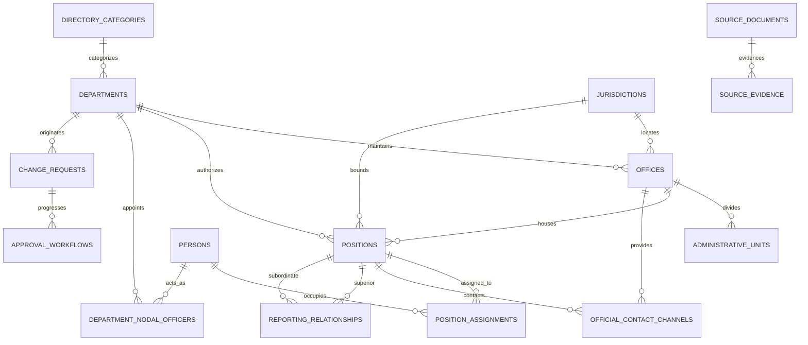

# Contact Directory Entity-Relationship Diagram

```mermaid
erDiagram
    DIRECTORY_CATEGORIES ||--o{ DEPARTMENTS : categorizes
    DEPARTMENTS ||--o{ OFFICES : maintains
    DEPARTMENTS ||--o{ POSITIONS : authorizes
    DEPARTMENTS ||--o{ DEPARTMENT_NODAL_OFFICERS : appoints
    JURISDICTIONS ||--o{ OFFICES : locates
    JURISDICTIONS ||--o{ POSITIONS : bounds
    OFFICES ||--o{ ADMINISTRATIVE_UNITS : divides
    OFFICES ||--o{ POSITIONS : houses
    OFFICES ||--o{ OFFICIAL_CONTACT_CHANNELS : provides
    POSITIONS ||--o{ POSITION_ASSIGNMENTS : assigned_to
    POSITIONS ||--o{ OFFICIAL_CONTACT_CHANNELS : contacts
    POSITIONS ||--o{ REPORTING_RELATIONSHIPS : superior
    POSITIONS ||--o{ REPORTING_RELATIONSHIPS : subordinate
    PERSONS ||--o{ POSITION_ASSIGNMENTS : occupies
    PERSONS ||--o{ DEPARTMENT_NODAL_OFFICERS : acts_as
    SOURCE_DOCUMENTS ||--o{ SOURCE_EVIDENCE : evidences
    CHANGE_REQUESTS ||--o{ APPROVAL_WORKFLOWS : progresses
    DEPARTMENTS ||--o{ CHANGE_REQUESTS : originates
```
